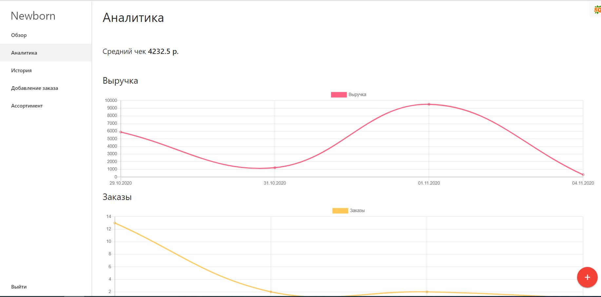
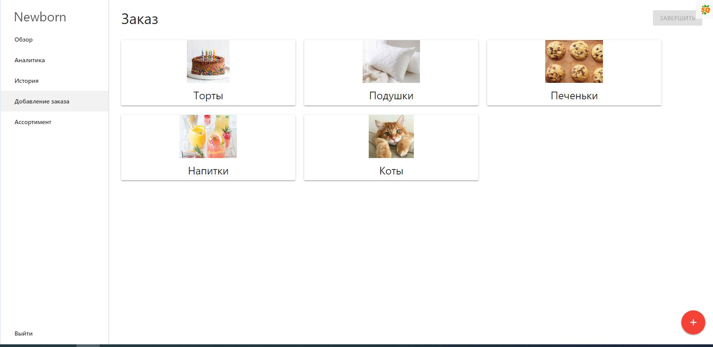

# CRM Newborn

[Демонстрация верстки](https://fierce-castle-23806.herokuapp.com)

Приложение создано в рамках прохождения курса "MEAN. Angular, Node, Express, Mongo. Создание Сервиса с Нуля"
https://www.udemy.com/course/mean-stack-full-guide/

## При верстке данного макета, использовалась система сборки nodejs, angular

### Для установки всех зависимостей

    npm i

Убедитесь, что на вашем компьютере установлен npm

### Для запуска сборщика

    npm run dev

### Используемые средства

    - angular
    - mongoose
    - nodejs
    - express
    - passport.js
    - chart.js
    - materialize.css